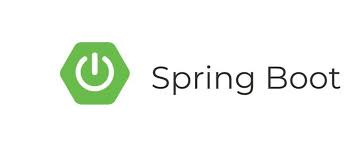

# Custom Final Project

This is a template for a full stack postgresql/java/vue project, with basic boiler plate and authentication set up.


An SQL script to set up a postgres database, with authentication tables.



A Server Application written in Java/Spring Boot configured to use a FinalProject database, providing REST controllers for users/auth, and including the following Spring Boot libraries:

  - Spring Boot DevTools
  - Spring Boot Web
  - Spring Boot Data JPA/Postgres
  - Spring Boot Validation
  - Simple JWT auth provided by eu.fraho.spring


A client application written in Vue.js configured to connect to the SpringBoot server REST API to provide a basic login system.  Vue is also configured to include the following libraries:
  - Vuex
  - Vue Router
  - Axios
  - Bootstrap Icons
  - Vuetify Components
  - Open Props

 ---
 
## Custom Project Requirements
### Design Requirements

All applications must be accompanied by project design documents, wireframes, mockups, and/or diagrams.  Required design documents must be submitted along with the source code in the `client/design` folder.

* Documentation of functional requirements to act as the application's Minimum Viable Product ([MVP](https://en.wikipedia.org/wiki/Minimum_viable_product)).
  * A functional requirement describes what the application can do or provide from a user's perspective.
  * Functional requirements can be encapsulated into a *[user story](https://en.wikipedia.org/wiki/User_story)*. For example,
    * "As an authenticated user, I can click the "Cart" link on the navigation bar to visit my shopping cart."
    * "As an anonymous or authenticated user, on the Products page, I can view the product list as a tiled view or a table view, by clicking the appropriate icon."
* [Wireframes](https://www.figma.com/resource-library/what-is-wireframing/)
  * Show the **basic** page layout
    * Header, footer, main content area, navigation, headings, whitespace/padding
    * Indicate interactive elements
      * Buttons, links, forms, dropdown menus, pop-ups ([modal](https://www.digitalsilk.com/digital-trends/modal-in-web-design/)), switches
    * Placeholder images
    * Mock text and mock data
  * Indicate the transitions between pages
  * A separate wireframe for every page view in your application
  * A separate wireframe for mobile and desktop page views
    * Desktop view is 1024 pixel width or greater
    * Mobile view is 425 pixel width or smaller
  * Can be created by hand or digitally using an online tool like [Figma](https://www.figma.com/)
    * Here are some [examples](https://www.visual-paradigm.com/learning/handbooks/agile-handbook/wireframe.jsp) of wireframes
    * Place your wireframes in the `client/design` folder

### Project Requirements

* Documentation/Implementation of at least **7 functional requirements**
  * At least 3 requirements must include an authenticated user
  * The 3 provided login, logout, and registration requirements **can not** be included as a part of the 7 functional requirements
* Must extend the Vue.js application provided, without resorting to any direct DOM manipulation or event handling.  If you are creating your own, you must use Vue, and not rely on native JS DOM manipulation or event handling.
* Must include at least 3 pages other than register/logout (home counts) (views)
  * Must use Vue Router to transition between the pages (views)
* Must create/consume a REST API hosted by the provided server application 
  * You can create new models/daos/controllers or copy over the ones from your module-2 final project
  * The application must enable users to either create, update, or delete data in the database through the REST API
* CSS styling requirements (must be implemented directly, not with a library - though you can use libraries to add *additional* styling)
  * Styling that utilizes CSS flexbox and/or CSS grid
  * Support for both desktop and mobile views (use 1024 as the breakpoint)
* A clear purpose, function, or utility

---

## Initial Project Setup/Run

### Setting up the database

To set up the database, you will need to have Postgresql installed, and a "FinalProject" database created. You can use PGAdmin to create the database.

Once you have created the database, you can use pgadmin or the integrated VS Code SQLTools to run the SQL script located at `database/create-script.sql` to set up the tables.

### Running the server

Open the server/POM.xml file in IntelliJ IDEA, and run the main application file.

Once the server is running, you should be able to navigate to `http://localhost:8080` in your browser and see that the server is running. (You should see the default Spring Boot page that says "Whitelabel Error Page.")

### Running the client

Open the client folder in VSCode, and open a terminal window in the client folder, and run the following commands:

```bash
npm install
npm run dev
```

You should now be able to navigate to `http://localhost:5173` in your browser and see that the vue client application is running.  You should be able to register for a new account, or login to the existing admin/admin account.

Once logged in, you will see a home page the presents nothing and an about page with some simple third-party library examples.

### Provided Authentication System

The provided authentication includes an authentication stack and user endpoints in the java application using the `eu.fraho.spring library`, a `UserController`, and a `ProfileController`.  The client application includes a login page and a routing system that will redirect to the login page if the user is not authenticated.

### Provided API Service Module

The provided API service module in the client application includes methods to access the user/auth endpoints in the java application.  You should make additional service files for each table in your database that you want to access.

This can be found in the `client/src/services` folder.

## Developing Your Application

### Designing Your Application

Before you begin developing your application, you should create wireframes and a design document that outlines the functional requirements of your application.  This will help you to plan out your application and ensure that you are building something that meets the requirements of the project.  See the design requirements section above for more information on what is required.

### Adding to the the data model

The next thing you'll want to do once design is completed is to add objects to the data model to reflect your own application.  You can do this by adding new tables to the database, updating the server application to provide REST endpoints for your new tables, and creating service files in the client application to access your new REST endpoints.

You may need to review various lessons and code from Module 2 in the curriculum to refresh your memory on how to do the server part of of this.  While you may be tempted to avoid doing so and fall back on an existing project, refreshing your memory and practicing your Java Spring Boot skills will be beneficial to your learning and help reinforce your understanding of the material.

With that said, if you have an existing project that you would like to use as the basis for your final project, you can migrate the data model from that project to this project by following the steps in the "Migrating Server Code from an Existing Project" section below.

To change the data model to reflect your own application, you will need to add the following for each new table:

- Add the create/drop table SQL to the `database/create-script.sql` file
- Add a new model class to `server/src/main/java/Models` directory
  - The existing model classes use lombok annotations to generate getters/setters/constructors.  You can use these annotations for your model classes as well, or write the getters/setters/constructors yourself.
- Add a new DAO class to the `server/src/main/java/Daos` directory to provide data access methods
- Add a new controller class to the `server/src/main/java/Controllers` directory to provide REST endpoints for your new table
- Add a new service file and methods to the client API service `client/src/services` to access your new REST endpoints
- Import your services file into the appropriate Vue views/components and use your newly added methods to work with the data.  (See the included service file for details on how to import the store and include the JWT token in your requests for authentication)

#### Creating Data Objects/Records that "Belong" to a User

If you want to create data objects that "belong" to a user, you can do this by adding a `username` field to the corresponding sql table, and then using the `Principal` parameter in your Spring boot controllers to get the name of the currently logged in user and pass that to your DAO methods so that they can create/query records that belong to your user.

1. Add a `username` field to the table in the `create-script.sql` file
2. Add a `username` field to the model class in the `server/src/main/java/Models` directory
3. Update your DAO mapping method to include the `username` field in the query
4. Make your DAO methods take a `username` parameter and pass it to your queries.
5. In your controller methods, use the `Principal` parameter to get the name of the currently logged in user and pass it to your DAO methods.

#### Customizing user records (Optional)

User records are important to the authentication system, and are stored in the `users` table.  You can add additional fields to the user table by adding fields to the `User` model class, and updating the `database/create-script.sql` file to reflect the changes.  This will not affect the authentication system, but will allow you to store additional information about your users if you like.

### Migrating Server Code from an Existing Project (e.g. Module 2 Final)

If you have an existing project that you would like to use as the basis for your final project, you can migrate the data model from that project to this project by following these steps:

1. Copy the create-script.sql file from your existing project to the `database` folder in this project
2. Copy the model classes from your existing project to the `server/src/main/java/Models` folder in this project.  Update the package name in the model classes to match the package name in this project.  (Do not copy any User/auth related model classes as these are already provided in this project)
3. Copy the DAO classes from your existing project to the `server/src/main/java/Daos` folder in this project.  Update the package name in the DAO classes to match the package name in this project.  (Do not copy any User/auth related DAO classes as these are already provided in this project)
4. Copy the controller classes from your existing project to the `server/src/main/java/Controllers` folder in this project.  Update the package name in the controller classes to match the package name in this project. (Do not copy any User/auth related controller classes as these are already provided in this project)


### Adding Pages to the Vue Application

The main way that you will build your vue app is by customizing the home page and adding new pages to the application.

To add pages to the Vue application, you will need to create new components in the `client/src/views` directory, and then add routes to those components in the `client/src/router/index.js` file.  If you want to add a top-level navigation link to your new page, you can do that in the `client/src/App.vue` file.  If you want to add a link to your new page from an existing page, you can do that in the component for that page.
 
If you need a refresher on dealing with pages/routing, consult the Module 3 Week 7 curriculum on Vue Router.

#### Making the page interact with the server

You'll make your page display/update data by importing the appropriate service file from the `client/src/services` directory, and then using the methods in that service file to interact with the REST API to pull data from the server, or send data to the server.  When data is pulled from the server, you will store it in the `data` object of the component, and then use that data in the template to display it to the user.  When data is sent to the server, you will use the service method to send the data.

If you need a refresher on communicating with a server API from Vue, consult the Module 3 Week 8 curriculum on axios and service classes.

### Components (How and When)

In building your pages, you may find parts of the page that you want to move to a component.  There are typically two reasons for this:

- You want to reuse the component in multiple places
- You want to break up the page into smaller, more manageable pieces

When and how you choose to break up your page into components is up to you, and depends on the problem you are solving and what approach will be the most maintainable and readable.  There is no hard rule for how fine-grained to make your components, but you should aim to make them as fine-grained as necessary to keep your code clean and readable.

If you need a refresher on components, consult the Module 3 Week 1 intro to vue section, and the Module 3 Week 7 curriculum on Vue Components communication.

### The Vuex Store

#### Global User Data
A vuex store is already included and set to manage login information for the current user.  If you want to access this information from a page or component, you can get it from the store with the following variables:

- `this.$store.state.user` - The current user object (username, email, password hash) 
- `this.$store.state.token` - A string representing the current user's JWT token for authentication in your services classes.
- `this.$store.state.userRoles` - An array of strings that reflect the current user's roles.

You may use these in components to show/use the current user's information, or to conditionally show/hide elements based on the user's role.

You will almost certainly want to use this data in your service classes to send the token with your requests to the server.  You can do this by importing the store into your service classes from main (see the included authentication service) and then accessing the token from the store.

#### Adding to the Store

Depending on your application, it is unlikely that you will need to add additional data to the store as most data is not needed to be shared higher than the page/view level.  However, if you do, you can add additional state variables and mutators to the store in the `client/src/store/index.js` file, and then access them in your components in the same way that you access the user data.

If you need a refresher on the store, consult the Module 3 Week 7 curriculum on Vuex.

### Styling Your Application

You can style your application by adding CSS to the global `client/src/assets/main.css` file.  You can also add CSS to individual components by adding a `style` tag to the component file with a `scoped` attribute.  

If you need a refresher on styling in Vue, consult the CSS section in the Module 3 Week 2 curriculum.

#### Global Styles

Global styles are styles that apply to the entire application.  You can add global styles to the `client/src/assets/main.css` file.  These styles will apply to all components and all HTML in the application.  You generally want to use global styles for things like setting the font, setting the background color, setting the text color, etc. when it applies to the overall theme of the application.

You usually want to avoid any layout styles other than the top-level App component as layout styles are usually specific to the page or component that they are in.

#### Component Styles

Component styles are styles that apply only to a specific component.  You can add component styles to a component by adding a `style` tag to the component file with a `scoped` attribute.  These styles will only apply to the component that they are in, and will not affect other components or the global styles.  You generally want to use component styles for things like setting the width of a component, setting the padding of a component, setting the margin of a component, etc. when it applies only to that component.

---

## Third-Party Libraries (Optional)

The provided project includes some third-party libraries that you can *optionally* use to enhance your application.

### Using Bootstrap Icons

The project is set up to use Bootstrap Icons.  You can see an example and links to documentation for this on the default about page.  

### Using Vuetify Components

The project is set up to use Vuetify components.  You can see an example and links to documentation for this on the default about page.

### Using Open Props in your CSS

The project is set up to use Open Props in the client application.  You can see an example of this in the global css file at `client/src/assets/main.css` and links to documentation for this on the default about page.
